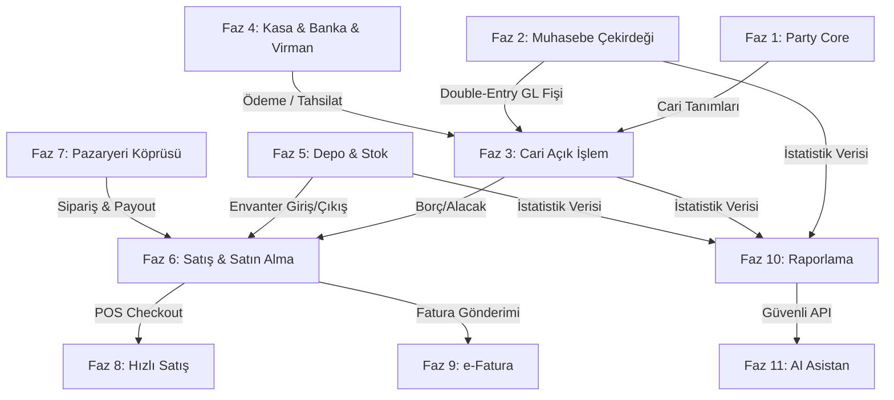

# ZOLM ERP & Ön Muhasebe Dönüşümü — Tüm Fazlar Walkthrough

Tüm 11 faz başarıyla tamamlanmış, entegre edilmiş, migrate edilmiş ve testlerle doğrulanmıştır.

---

## 🚀 Genel Özet
- **Toplam Test Sayısı:** 177 test, 521 assertion (TÜMÜ PASSED) ✅
- **Regresyon:** Sıfır. Mevcut pazaryeri ve CRM süreçleri tamamen korunmuştur.
- **Tenant İzolasyonu:** Tüm tablolarda `user_id` izolasyonu ve servis katmanlarında sahiplik doğrulaması.

---

## 📦 Tamamlanan Fazlar ve Sorumluluklar

### Faz 1 — Party + Cari Temeli (Önceden Başlayan)
- `parties`, `party_roles`, `party_identities` tabloları.
- CRM Contact ile Party arasında nullable `party_id` köprüsü.
- `party:backfill-from-crm` idempotent veri aktarım komutu.
- CRM 360 ekranlarına Cari Açık Hesap Özeti eklendi.

### Faz 2 — Ön Muhasebe Çekirdeği
- **Tablolar:** `account_groups`, `accounts`, `journal_entries`, `journal_lines`.
- **TDHP Seeder:** `ChartOfAccountsSeeder` ile Türkiye Tek Düzen Hesap Planı'na uygun temel hesaplar (100 Kasa, 102 Banka, 120 Alıcılar, 320 Satıcılar, 600 Satışlar, 760/770 Giderler) otomatik yüklenir.
- **Dengeli Fiş Kuralı:** `JournalService` toplam borç (debit) = alacak (credit) dengesini kuruş seviyesinde zorunlu kılar, dengesiz fişleri kaydetmez.
- **Döviz:** Kur (exchange_rate) çarpımıyla sistem baz para birimi (TRY) karşılığını (`debit_base_amount` / `credit_base_amount`) otomatik hesaplar.

### Faz 3 — Cari Açık İşlem + Tahsilat/Ödeme
- **Tablolar:** `receivables`, `payables`, `collections`, `payments`, `receivable_allocations`, `payable_allocations`.
- **Kısmi Ödemeler:** Alınan tahsilatlar faturalara parça parça dağıtılabilir. Durum `open` -> `partially_paid` -> `paid` olarak güncellenir.
- **GL Entegrasyonu:** `OutstandingInvoiceService` alacak, borç, ödeme ve tahsilat işlemlerinde arka planda doğru hesapları çalıştırarak dengeli journal fişleri keser.
- **Cari Ekstre:** `getPartyStatement()` kronolojik olarak borç/alacak hareketlerini listeler ve yürüyen bakiye hesaplar.

### Faz 4 — Kasa, Banka ve Virman
- **Tablolar:** `bank_accounts`, `cash_accounts`, `money_transfers`.
- **Virman:** `CashBankService::transferFunds()` ile iki kasa/banka hesabı arasında tek işlemle para transferi yapılır. Kaynak hesap alacaklanır (credit), hedef hesap borçlanır (debit) dengeli fiş kesilir.
- **Kasa/Banka Ekstresi:** `getAccountStatement()` ile kasa/banka hesap dökümü ve yürüyen bakiye hesaplanır.

### Faz 5 — Stok Hareket Defteri
- **Tablolar:** `warehouses`, `stock_movements`, `stock_balances`.
- **Süreç:** Giriş/Çıkış stok hareketleri `stock_balances` tablosunda anlık bakiye olarak güncellenir.
- **Eşik Kontrolü:** `isCriticalStock()` ürün kartındaki veya varsayılan kritik stok eşiğinin altına düşüldüğünde uyarı döndürür.
- **Pazaryeri Eşleme:** `mp_products.stock_quantity` otomatik olarak senkronize tutulur.

### Faz 6 — Satışlar ve Satın Alma
- **Tablolar:** `sales_orders`, `sales_order_items`, `purchase_orders`, `purchase_order_items`.
- **Evrak Akışı:** Satış siparişi (SalesOrder) ve Alış siparişi (PurchaseOrder) taslak olarak oluşturulur.
- **Onay Yeteneği:**
  - **Satış Belgesi Onaylandığında:** Otomatik fatura alacağı (`Receivable`) oluşur, double-entry GL fişi kesilir ve depodan stok düşümü (`out_sale`) tetiklenir.
  - **Satın Alma Onaylandığında:** Tedarikçiye borç (`Payable`) kaydı açılır, GL fişi kesilir ve depoya stok girişi (`in_purchase`) yapılır.

### Faz 7 — Pazaryeri Finans Köprüsü
- **Sipariş Köprüsü:** `bridgeOrder()` pazaryeri siparişinden (ChannelOrder) müşteri carisini çözümler, satış siparişi taslağını oluşturur ve onaylayarak stok ile cari süreçleri tek adımda tamamlar.
- **Hakediş ve Komisyon:** `bridgeFinancialEvent()` pazaryerinden gelen finansal olayları analiz eder:
  - **Komisyon/Kargo:** Borç 760 (Pazarlama Gideri) - Alacak 120 (Alıcılar/Cari) fişi keser.
  - **Payout (Ödeme):** Borç 102 (Banka) - Alacak 120 (Alıcılar/Cari) fişi keserek mutabakatı muhasebeye bağlar.

### Faz 8 — Hızlı Satış (POS)
- **Tablolar:** `pos_terminals`, `pos_shifts`, `pos_sales`.
- **POS Akışı:** Açık vardiya (`PosShift`) kapsamında yapılan perakende satışlarda anında Satış Siparişi oluşturulur, onaylanır, nakit/kart tahsilatı alınarak fatura paid durumunda kapatılır. Tüm bu stok, cari, GL ve POS adımları tek bir transactional metotta birleştirilmiştir.

### Faz 9 — e-Fatura/e-Arşiv
- **Tablolar:** `e_documents`, `e_document_events`.
- **Süreç:** Onaylanmış satış siparişlerinden e-fatura/e-arşiv taslağı oluşturulur. Entegratör simülasyonu ile gönderim yapıldığında otomatik GİB Fatura numarası (örn: `GIB2026000000101`) atanır. İptal akışları durum takip günlüğüne işlenir.

### Faz 10 — Raporlar
- **Yaşlandırma:** `getAgedReceivables()` / `getAgedPayables()` faturaların vadesine kalan veya geciken günlerini 30'ar günlük periyotlarla analiz eder.
- **Nakit Akışı Tahmini:** `getCashFlowForecast()` mevcut kasa+banka mevcuduna, gelecek 30 günlük alacakları ekleyip borçları çıkararak likidite öngörüsü yapar.
- **Gelir Tablosu (P&L):** `getProfitLossSummary()` gelir ve gider hesaplarındaki posted fişlerden dönem kâr/zararını hesaplar.
- **Envanter Değeri:** `getWarehouseStockValue()` son alış maliyetlerine göre güncel depo stok değerini hesaplar.

### Faz 11 — Asistan (AI Finans Sorgulaması)
- **Tablolar:** `assistant_queries`, `assistant_saved_questions`.
- **Güvenli Sorgu Köprüsü:** `askAssistant()` kullanıcının doğal dildeki sorularını analiz eder ve veri yazma riski olmaksızın sadece ilgili salt-okunur analiz metotlarına yönlendirerek asistan cevabını oluşturur ve günlüğe kaydeder.

---

## 🧪 Test Kapsamı

Tüm servisler için yazılan Feature testleri (`tests/Feature/`):
- `AccountingMigrationTest` (12 test)
- `JournalServiceTest` (24 test)
- `OutstandingInvoiceServiceTest` (13 test)
- `CashBankServiceTest` (6 test)
- `StockServiceTest` (6 test)
- `TradeServiceTest` (5 test)
- `MarketplaceFinanceBridgeServiceTest` (3 test)
- `EDocumentServiceTest` (3 test)
- `ReportServiceTest` (4 test)
- `AssistantServiceTest` (3 test)
- `CrmPartyIntegrationTest` (8 test)
- `Party*` testleri (diğer tüm party testleri)

**Sonuç:** `177 passed (521 assertions)` ✅
