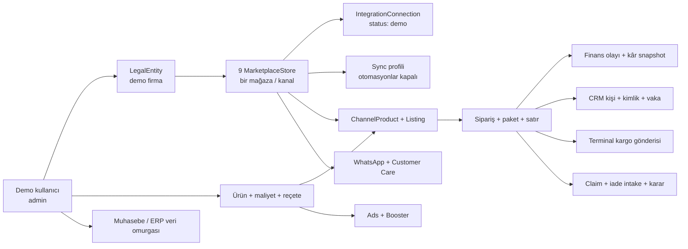

# ZOLM Demo Tenant Rehberi

Bu belge, ZOLM'un ana modüllerini gerçek pazaryeri, kargo, WhatsApp veya ERP servislerine istek göndermeden birlikte incelemek için hazırlanan demo tenant'ın kullanım rehberidir. Yeni bir ekip üyesinin demo ortamını kurması, güvenlik sınırlarını anlaması ve modüller arası smoke test yapması için başlangıç noktasıdır.

> Demo tenant uygulama içindeki veri ilişkilerini, ekranları ve entegrasyon akışlarını doğrular. Gerçek credential, sandbox bağlantısı, API yetkisi, webhook teslimi, rate limit veya canlı sağlayıcı davranışı için kanıt değildir.

## Hızlı başlangıç

Ön koşullar:

- Uygulama ortamı `local` veya `testing` olmalıdır.
- Migration'lar tamamlanmış olmalıdır.
- Tercihen yalnız demo kullanıcıya ayrılmış ayrı bir veritabanı kullanılmalıdır.
- İlk kurulum sırasında scheduler ve queue worker'lar durdurulmalıdır.

Kurulum:

```bash
php artisan zolm:demo:seed
```

Varsayılan giriş bilgileri:

| Alan | Değer |
| --- | --- |
| E-posta | `mockdata1@zolm.test` |
| Parola | `password` |
| Rol | `admin` |
| Firma | `ZOLM Mockdata Mobilya A.Ş.` |
| Para birimi | `TRY` |

Kurulumdan sonra bağımsız sağlık kontrolü:

```bash
php artisan zolm:demo:audit
```

Komut `FAIL` üretmiyorsa demo veri grafiği ve denetlenen outbound bariyerleri sağlıklıdır. `WARN` kayıtları komutun başarısız olmasına neden olmaz; özellikle paylaşımlı veritabanı uyarısı mutlaka ayrıca değerlendirilmelidir.

## Amaç ve kapsam dışı konular

Demo tenant şu sorulara cevap vermek için tasarlanmıştır:

- Kullanıcı, firma, mağaza, ürün, sipariş ve finans kayıtları doğru zincirde mi?
- Aynı sipariş CRM, kargo, iade ve müşteri iletişimi ekranlarında ilişkilendirilebiliyor mu?
- Modül sayfaları temsilî verilerle açılıyor ve temel sorgular sonuç üretiyor mu?
- Pazaryeri manuel sync ve aksiyon servisleri demo mağazada dış ağa çıkmadan çalışıyor mu?
- Otomatik sync, kampanya, takip ve outbound kayıtları güvenli biçimde pasif mi?
- Yeni bir ekran veya servis mevcut veri modeliyle bütünleşebiliyor mu?

Şunlar kapsam dışıdır:

- Gerçek pazaryeri kullanıcı adı, API anahtarı veya mağaza yetkisinin doğrulanması
- Gerçek sipariş, ürün, finans, soru veya claim payload'larının sağlayıcıdan çekilmesi
- Canlı webhook imzası ve teslimat zinciri
- Gerçek kargo etiketi veya takip sorgusu
- Gerçek WhatsApp, e-posta, webhook, Telegram, CRM veya ERP gönderimi
- Sağlayıcı rate limit, gecikme, hata kodu ve sözleşme değişiklikleri
- Üretim ve Operasyon motorlarının gerçek müşteri Excel dosyalarıyla kabul testi

## Veri omurgası

Demo verisi rastgele ve birbirinden kopuk satırlardan oluşmaz. Aynı kullanıcı, firma, ürün ve siparişler farklı modüllerde tekrar kullanılarak ilişki zinciri test edilir.



Deterministik işaretler:

- Seeder sürümü: `mockdata1_full_v1`
- Genel kayıt işareti: `ZOLM-DEMO`
- Sabit senaryo zamanı: `2026-07-01 09:00:00 Europe/Istanbul`
- Tenant-kritik dış kimlikler, okunabilir e-posta slug'ına tam e-postanın stabil SHA-256 özetinden 10 karakter eklenerek ayrıştırılır. Eski local-part tabanlı mağaza, kargo ve WhatsApp fixture kimlikleri tekrar seed sırasında aynı kaydı koruyarak yeni formata taşınır.
- Sahte URL'ler `.invalid` alan adlarını, credential alanları ise `demo-no-network` değerini kullanır.

Bu işaretler kayıtların sentetik olduğunu görünür kılar; asıl outbound güvenlik bariyeri yalnız URL veya credential değildir. Pazaryeri tarafındaki temel bariyer bağlantı durumunun tam olarak `demo` kalması ve mağaza bazlı connector çözümlemesidir.

## Modül kapsamı

### Ürün, Üretim ve Operasyon

Seeder üç ana ürün, üç malzeme, bir üretim reçetesi ve üç reçete satırı oluşturur. Ürünlerde satış fiyatı, maliyet, ambalaj, kargo, stok, KDV ve komisyon gibi pazaryeri ile üretimi bağlayan alanlar bulunur.

`DefaultProfileSeeder::runForUser()` demo kullanıcı için idempotent olarak iki motor profili oluşturur:

- `Varsayılan Üretim`
- `Varsayılan Operasyon`

Bu veri; ürün kartları, maliyet ilişkileri, reçete ekranları ve profil seçimini smoke test etmek içindir. Gerçek Excel yükleme ve çıktı doğrulaması için ayrıca küçük, kontrollü fixture dosyaları kullanılmalıdır.

### Pazaryeri omurgası

`MarketplaceProviderRegistry` içinde bulunan her sağlayıcı için bir demo mağaza oluşturulur. Mevcut registry dokuz kanal içerir:

- Trendyol
- Hepsiburada
- N11
- Koçtaş
- Pazarama
- Amazon
- Çiçeksepeti
- WooCommerce
- Shopify

Her mağazada temsilî olarak şu zincir bulunur:

- Demo bağlantı ve tamamen kapalı sync profili
- Sipariş, ürün ve finans için tamamlanmış sentetik sync geçmişi
- Kanal ürünü ve master ürüne bağlı listing
- Sipariş, paket ve sipariş satırı
- Finans olayı ve kâr snapshot'ı
- Sağlayıcı registry'si destekliyorsa claim ve claim satırı
- Sağlayıcı registry'si destekliyorsa müşteri sorusu ve AI cevap taslağı

Sipariş durumları kanallar arasında `delivered`, `new`, `shipped`, `returned` ve `cancelled` örneklerini gösterecek şekilde dağıtılır.

Demo connector bütün ortak pazaryeri capability'lerini kullanılabilir gösterir. Bu davranış, ZOLM içindeki UI ve servis yollarını denemek içindir; gerçek sağlayıcının aynı capability'yi desteklediği anlamına gelmez. Örneğin demo Amazon mağazasındaki başarılı bir fiyat veya claim aksiyonu Amazon canlı connector'ının hazır olduğunu kanıtlamaz.

### Muhasebe ve ERP veri omurgası

Ana demo komutu önce `accounting:seed-demo --user=<id>` çağrısını yapar. Bu katman aşağıdaki temsilî kayıtları hazırlar:

- Firma ve hesap planı
- Müşteri ve tedarikçi carileri ile kimlik/rol kayıtları
- Kasa ve banka hesapları
- Depo, stok hareketleri ve stok bakiyeleri
- Satış ve satın alma siparişleri
- Alacak, borç, tahsilat, ödeme ve dağıtımlar
- Para transferi, yevmiye fişi ve fiş satırları

Bu kapsam muhasebe/ERP ekranlarının uygulama içi veri omurgasıdır. Aktif bir harici ERP endpoint'i veya gerçek ERP push ayarı oluşturulmaz.

Yeni muhasebe fixture'ları ilk seed işleminin takvim gününü senaryo tarihi olarak kaydeder. Aynı source key ile sonraki günlerde tekrar seed edildiğinde satış siparişinin mevcut tarihi anchor kabul edilir; sipariş, tahsilat, ödeme, transfer ve yevmiye kayıtları geriye dönük olarak başka güne taşınmaz. `--reset` fixture'ları kaldırdığı için yeniden kurulan senaryo o günün tarihini alır. Bu davranış güncel KPI ekranlarını beslerken takvimler arası idempotency'yi korur.

`accounting:seed-foundation` ayrı bir legacy altyapı komutudur; tam demo tenant kurulumu için onun yerine `zolm:demo:seed` kullanılmalıdır.

### CRM

Trendyol siparişine bağlı bir CRM kişisi, pazaryeri kimliği ve açık iade vakası oluşturulur. Böylece müşteri kimliği, sipariş ve iade süreci aynı grafikte görülebilir. Bu temsilî kapsam tüm CRM timeline veya görev türlerinin eksiksiz veri seti değildir.

### Kargo

Seeder:

- `carrier_code=demo` olan pasif bir kargo hesabı,
- Trendyol sipariş ve paketine bağlı, `delivered` durumunda terminal bir gönderi

oluşturur. Hesap aktif değildir ve takip otomasyonu kapalıdır. Terminal gönderi scheduler tarafından aktif takip adayı olmamalıdır.

Demo pazaryeri sipariş aksiyonlarında kargo oluşturma veya takip yenileme yolu da gerçek taşıyıcı servisine gitmeden deterministik demo cevap üretir.

### İade

Claim zincirine bağlı tamamlanmış bir intake batch, `decisioned` durumda intake item, offline analiz ve demo karar kaydı oluşturulur. Analiz sağlayıcısı `demo`, model `offline-fixture` olarak işaretlidir; medya veya AI servisi çağrılmaz. Karar üzerinde `marketplace_pushed_at` boş bırakılır.

### Reklam ve Trendyol Booster

Reklam tarafında pasif bir Trendyol reklam hesabı ve `paused` kampanya bulunur. Booster tarafında master ürüne/listing'e bağlı bir ürün, kârlılık ve karar alanlarıyla oluşturulur.

Güvenlik için:

- Reklam hesabı pasiftir.
- Kampanya `paused` durumundadır.
- Booster fiyat, stok ve keyword takipleri kapalıdır.
- `tracking_status=paused` ve otomatik analiz yenileme kapalıdır.

### WhatsApp

WooCommerce demo mağazasına bağlı olarak şu kayıtlar hazırlanır:

- Pasif WhatsApp hesabı
- `test_mode=true`, `automation_enabled=false`, `network_access=blocked` ayarları
- Demo kişi, transactional tercih ve consent geçmişi
- Onaylı görünümlü sentetik şablon
- Açık görüşme ve bir inbound mesaj

Seeder gönderilebilir `queued`, `processing` veya `retry` outbox kaydı oluşturmaz. Hesap pasif kaldığı sürece bu veriler görüşme ve profil ekranlarını incelemek içindir; Meta Cloud API bağlantısını doğrulamaz.

### Customer Care

Demo kullanıcı firma organizasyonuna admin üye yapılır. Her pazaryeri mağazası için bir destek kanalı ve kullanıcı rol ataması oluşturulur. Bütün destek kanalları pasiftir; AI modu manuel, auto-reply ve outbound kapalıdır. Trendyol kanalında bir açık görüşme ve inbound müşteri mesajı bulunur.

Release Center açıkken de grounding akışının incelenebilmesi için ayrıca yayındaki bir bilgi makalesi, yayınlanmış sentetik release package, paket öğesi/yayın olayı ve pakete bağlı `is_current=true` artifact sürümü hazırlanır. Fixture, gerçek iki kişili governance onayı taklit etmez: `approved_by` boş kalır ve yayın olayı `synthetic_fixture_bypass` olarak işaretlenir. Demo üzerinde daha yeni bir current sürüm oluşturulmuşsa normal reseed bunu geriye sarmaz. Dış cevap gönderimi açılmaz.

Customer Care sayfalarının büyük bölümü ortam-geneli feature flag'lerle kapalı olabilir. Verinin seed edilmiş olması tek başına menü veya route'un görünmesini sağlamaz.

## Komutlar

### İdempotent seed

```bash
php artisan zolm:demo:seed
```

Komut yalnız `local` ve `testing` ortamlarında çalışır; production için `--force` kaçış yolu yoktur. Kullanıcıyı oluşturur veya günceller, muhasebe omurgasını kurar, varsayılan profilleri ekler, modül seeder'larını ayrı transaction'larda çalıştırır ve sonunda audit üretir.

Aynı komut yeniden çalıştırıldığında deterministik anahtarlar üzerinden kayıtlar güncellenir veya korunur. Yeni bir demo senaryosundan önce yine de audit çalıştırılmalı ve beklenmeyen duplicate kayıtlar kontrol edilmelidir.

Özel credential kullanımı:

```bash
php artisan zolm:demo:seed \
  --email=ekip-demo@zolm.test \
  --password='en-az-8-karakter'
```

E-posta geçerli olmalı ve `@zolm.test` ile bitmelidir; parola en az sekiz karakter olmalıdır. Mağaza seller ID'leri okunabilir slug ile tam e-postanın stabil hash'ini birlikte taşır. Bu nedenle `foo.bar@zolm.test` ve `foo-bar@zolm.test` gibi aynı slug'a indirgenen adresler dahi farklı mağaza, kargo ve WhatsApp kimlikleri üretir; sahiplik uyuşmazlığında seeder işlem yapmayı reddeder. Senaryo marker'ları ve sürüm işareti bütün demo tenant'larda ortaktır. Global sorgu kullanan bilinen alanlar nedeniyle kabul testlerinde yine de birincil `mockdata1@zolm.test` kullanıcısı ve tercihen ayrı demo DB önerilir.

### Audit

```bash
php artisan zolm:demo:audit
```

Farklı demo e-postası için:

```bash
php artisan zolm:demo:audit --email=ekip-demo@zolm.test
```

Audit şu alanları denetler:

- Kullanıcı aktifliği ve admin rolü
- Firma ve `User -> LegalEntity -> MarketplaceStore` tenant zinciri
- Registry ile eşit mağaza sayısı
- Bütün bağlantıların `demo` durumda olması
- Bütün sync profillerindeki outbound seçeneklerin kapalı olması
- Pazaryeri veri grafiği
- Muhasebe/ERP temel kayıtları
- Üretim/Operasyon profilleri, malzeme ve reçete
- CRM ve iade kayıtları
- Pasif demo kargo hesabı ve terminal gönderi
- Pasif reklam, kampanya ve Booster takipleri
- Pasif WhatsApp hesabı ve boş gönderilebilir outbox
- Pasif Customer Care kanalları, yayındaki sentetik bilgi sürümü ve boş gönderilebilir dispatch kuyruğu

Standalone audit parola kontrol etmez. Parola, seed komutunun sonunda auditor'a ayrıca iletildiğinde doğrulanır. Audit yalnız `fail` bulgularında başarısız exit code üretir; `warn` bulguları görünür kalır ancak sağlık sonucunu tek başına bozmaz.

### Reset ve yeniden kurulum

```bash
php artisan zolm:demo:seed --reset
```

`--reset`, hedef e-postadaki demo kullanıcıyı ve ilişkili tenant verisini silip yeniden oluşturur. Silme bir veritabanı transaction'ında yapılır; foreign key veya cascade problemi oluşursa işlem geri alınır ve komut durur. Kullanıcı silinmeden önce hedef store ID'leriyle sınırlandırılmış reset servisi, `nullOnDelete` veya `restrictOnDelete` nedeniyle yetim kalabilecek Customer Care dispatch/attempt, kanal, AI, WhatsApp bilgi/hesap ve webhook köklerini doğru sırayla temizler; başka tenant kayıtlarına dokunmaz.

Reset öncesinde:

- E-postanın gerçekten demo kullanıcıya ait olduğunu doğrulayın.
- Paylaşımlı veritabanında yedek veya geri dönüş planı bulundurun.
- Başka ekip üyelerinin aynı demo tenant üzerinde çalışmadığından emin olun.
- Kullanıcıya sonradan eklenen ve cascade ilişkisi olmayan kayıtların ayrıca incelenmesi gerekebileceğini unutmayın.

Komut geniş tablo temizliği veya `truncate` yapmaz; yine de kullanıcı silme işlemi geri alınması zor bir aksiyondur.

### Paylaşımlı veritabanı

Veritabanında başka kullanıcılar varsa komut uyarı verir. Uyarıyı bilinçli olarak kabul ettiğinizi belirtmek için:

```bash
php artisan zolm:demo:seed --allow-shared-db
```

Reset ile birlikte:

```bash
php artisan zolm:demo:seed --reset --allow-shared-db
```

`--allow-shared-db` bir izolasyon mekanizması değildir; yalnız uyarının bilinçli kabulüdür. Seçenek verilmezse mevcut komut uyarı gösterir fakat seed işlemine devam eder. Ayrıca admin ve bazı legacy ekranlar global sorgular kullandığı için paylaşımlı DB üzerinde “yalnız kendi tenant verisini görüyor” sonucu çıkarılamaz.

## Outbound güvenlik bariyerleri

| Alan | Seed edilen güvenli durum | Koruma | Kalan risk |
| --- | --- | --- | --- |
| Pazaryeri | Connection `status=demo` | `resolveForStore()` gerçek connector yerine `DemoMarketplaceConnector` seçer | Status doğrudan DB'den değiştirilirse veya servis `resolve()` ile çağrılırsa demo yönlendirmesi kaybolabilir |
| Otomatik sync | Tüm pull, webhook, push ve nightly seçenekleri kapalı | Scheduler'a uygun aktif profil bırakılmaz | Kullanıcı ayarları sonradan açarsa audit başarısız olur |
| Manuel sync | Demo connector boş, deterministik pull cevabı verir | Gerçek HTTP çağrısı yapmadan run tamamlanır | “0 kayıt geldi” gerçek kanal bağlantı testi değildir |
| Fiyat/stok ve sipariş aksiyonları | Demo connector deterministik action ID üretir | Pazaryeri ve demo kargo aksiyonları dış ağa çıkmaz | Push toggle'ları varsayılan kapalıdır; test için açılırsa sonrasında tekrar kapatılmalıdır |
| Kargo | Hesap pasif, gönderi terminal durumda | Otomatik takip adayı oluşturulmaz | Gerçek carrier servislerini doğrudan çağıran başka ekran/komutlar demo kapsamı dışındadır |
| WhatsApp | Hesap pasif, test mode açık, otomasyon kapalı, outbox boş | Scheduler'ın göndereceği kayıt yoktur | Doğrudan `queued` outbox eklemek veya hesabı aktifleştirmek gerçek Meta çağrısına yol açabilir |
| Customer Care | Kanallar pasif, manual/suggestion-only mod | Auto-reply ve outbound kapalıdır | Ortam flag'lerini ve kanalları açmak gerçek Meta/Google/CRM/ERP connector'larını etkinleştirebilir |
| Returns | Intake tamamlanmış, karar sentetik ve push edilmemiş | AI iş kuyruğu veya marketplace action adayı yoktur | Global auto marketplace/WhatsApp bridge flag'leri ayrıca kapalı tutulmalıdır |
| Ads/Booster | Hesap ve kampanya pasif, bütün takipler kapalı | Otomatik analiz/takip adayı yoktur | Takipleri veya digest'i açmak harici okuyucu ya da bildirim çağrısı doğurabilir |

Ek kurallar:

- Demo mağazanın `IntegrationConnection.status` değerini `demo` dışında bir değere çevirmeyin.
- Demo tenant'a gerçek credential yazmayın; sandbox için ayrı mağaza ve tercihen ayrı kullanıcı oluşturun.
- Scheduler veya worker çalıştırmadan önce `zolm:demo:audit` sonucunu okuyun.
- Paylaşımlı DB'de scheduler/worker çalıştırmak diğer kullanıcıların aktif kayıtlarını da işleyebilir.
- `marketplace:smoke-test <store-id>` yalnız connection durumu `demo` olan mağazada offline çalışır. Non-demo mağazada aynı komut gerçek connection ve pull API çağrıları yapar.
- Demo güvenlik katmanı store-aware marketplace yollarını kapsar. Marketplace manager dışında doğrudan çağrılan provider, support, Booster veya başka entegrasyon servisleri otomatik olarak mock'lanmaz.
- Otomatik testlerde `Http::preventStrayRequests()`, `Http::fake()`, `Queue::fake()`, `Mail::fake()` ve gerektiğinde `Notification::fake()` kullanın.
- `.invalid` URL'ler son savunma katmanıdır; uygulama düzeyindeki demo connector ve pasif durumların yerine geçmez.

## 2026-07-19 scheduler güvenlik olayı

Yerel doğrulama sırasında scheduler servisi paylaşımlı veritabanına karşı kısa süreliğine başlatıldı. Demo mağazalar güvenli kalmasına rağmen scheduler, demo kullanıcı dışındaki aktif mağazaları global olarak taradı. `2026-07-19 23:48:54–23:56:19 Europe/Istanbul` aralığında 979 zamanlanmış sync çalışması harici çağrı deneyip başarısız oldu ve toplam 3.236 veritabanı işi üretildi: 3.232 `SyncMarketplaceDataJob` ve 4 WhatsApp zamanlama işi.

Olay şu şekilde sınırlandırıldı:

- Scheduler hemen durduruldu; Compose yapılandırmasındaki geçici değişiklik geri alındı.
- O pencereye ait 3.236 iş silinmedi; geri döndürülebilir biçimde `quarantine_scheduler_20260719` kuyruğuna taşındı.
- 3.232 queued sync run, güvenlik notuyla `failed` durumuna geçirildi.
- Olay penceresinde aktif queued schedule run kalmadığı doğrulandı.
- Scheduler tenant-aware ve paylaşımlı/local DB'de fail-closed hale gelene kadar ayrı P0 iş olarak açık tutuldu.

Karantina kuyruğu normal worker tarafından tüketilmemelidir. Bu kayıtların silinmesi veya kontrollü biçimde kurtarılması ayrı ve açık bir operasyon kararı gerektirir. Bu olay, demo tenant güvenli olsa bile global scheduler'ın paylaşımlı DB için güvenli kabul edilemeyeceğini gösterir.

## Feature flag'ler ortam genelindedir

Marketplace, muhasebe, Party Core, Customer Care, WhatsApp ve bazı iade özellikleri `.env`/config üzerinden yönetilir. Bu bayraklar kullanıcıya veya demo tenant'a özel değildir. Aynı uygulama instance'ında bir flag'i açmak bütün kullanıcıların menü, route, scheduler veya servis davranışını etkileyebilir.

En güvenli yerel düzen:

1. Demo için ayrı bir veritabanı oluşturun.
2. Mümkünse ayrı `.env` veya ayrı local app instance kullanın.
3. Gerçek API anahtarlarını bu ortamdan çıkarın.
4. Queue worker ve scheduler'ı varsayılan olarak kapalı tutun.
5. Yalnız inceleyeceğiniz UI feature flag'lerini açın.
6. Auto-reply, external action, digest ve bridge flag'lerini kapalı bırakın.
7. Config değiştirdikten sonra `php artisan config:clear` çalıştırın ve yeniden audit alın.

Güvenli yönü gösteren örnek local değerler:

```dotenv
APP_ENV=local
MAIL_MAILER=log

MARKETPLACE_MANUAL_SYNC_INLINE_ON_LOCAL=true
MARKETPLACE_TRENDYOL_BOOSTER_EMAIL_DIGEST_ENABLED=false
MARKETPLACE_TRENDYOL_BOOSTER_RETENTION_CLEANUP_ENABLED=false

WHATSAPP_ENABLED=false
WHATSAPP_TEST_MODE=true

CUSTOMER_CARE_DEMO_MODE=true
CUSTOMER_CARE_AUTO_REPLY_ENABLED=false
CUSTOMER_CARE_INTEGRATION_HUB_ENABLED=false
CUSTOMER_CARE_META_SOCIAL_ENABLED=false
CUSTOMER_CARE_GOOGLE_REVIEWS_ENABLED=false

RETURN_AUTO_MARKETPLACE_ENABLED=false
RETURN_WHATSAPP_BRIDGE_ENABLED=false
```

Muhasebe veya kapalı Customer Care ekranlarını görmek için ilgili UI flag'leri ayrı demo instance'ta açılabilir. `CUSTOMER_CARE_ENABLED=true` veya `ACCOUNTING_ENABLED=true` gibi bir değişiklik paylaşımlı ortamda yapılmamalıdır. UI erişimi için bir flag'i açmak outbound alt özelliklerini açma yetkisi vermez.

Otomatik testlerde yerel `.env` değerlerinin test varsayımlarını değiştirmemesi için Release Center ve Customer Care compliance bayrakları `phpunit.xml` içinde `force="true"` ile kapalı tutulur. Bir test bu davranışı doğrulayacaksa flag'i test içinde açıkça açmalıdır.

## Mock iç sağlık ile gerçek sandbox doğrulaması arasındaki fark

| Doğrulama | Neyi kanıtlar? | Neyi kanıtlamaz? |
| --- | --- | --- |
| `zolm:demo:audit` | Tenant zinciri, temsilî kayıtlar, denetlenen pasif durumlar ve outbound bariyerleri | Gerçek API credential veya network erişimi |
| Demo bağlantı doğrulama | UI ve servis akışının demo connector'a ulaştığı | Sağlayıcının credential'ı kabul ettiği |
| Demo manuel sync | Run lifecycle, durum güncellemesi ve sync servis entegrasyonu | Gerçek payload normalizasyonu veya sayfalama |
| Demo push/aksiyon | Queue/action orchestration, idempotent action ID ve sonuç işleme | Fiyatın, stokun, claim'in veya paketin sağlayıcıda değiştiği |
| Fixture tabanlı connector testi | Bilinen payload'ın normalize edilmesi ve beklenen HTTP request şekli | Sağlayıcının o günkü canlı sözleşmesi |
| Gerçek sandbox testi | Credential, endpoint, izin, request/response ve mümkünse webhook davranışı | Production trafik hacmi ve bütün canlı edge-case'ler |

Gerçek sandbox testi yapılacaksa demo bağlantıyı dönüştürmeyin. Ayrı bir sandbox kullanıcı/mağaza oluşturun; gerçek connector status'u, credential'ı ve allowlist'i yalnız o kayıtta kullanın. Testi opt-in bir komut veya kontrollü test planıyla çalıştırın ve dış sistemde oluşacak değişiklikleri önceden belirleyin.

## Bilinen tenant boşlukları

Demo tenant bütün projede eksiksiz tenant izolasyonu olduğu anlamına gelmez. Şu alanlar özellikle paylaşımlı DB kabul testinin dışında tutulmalıdır:

### SupplyOrder

`SupplyOrder` modelinde `user_id` bulunmaz. Supply ekranlarındaki kayıtlar kullanıcıya göre güvenilir biçimde ayrıştırılamaz. Bu nedenle seeder SupplyOrder kaydı oluşturmaz ve paylaşımlı DB'de supply modülü tenant izolasyonu kanıtı olarak kullanılmamalıdır.

### ProductionRevenue

`ProductionRevenueEntry` üzerinde `user_id` yoktur ve `work_date` benzersizliği globaldir. `ProductionRevenue` sorguları entry'leri tenant'a göre filtrelemez. Seeder bu tabloya veri yazmaz; üretim ciro modülü yalnız boş durum/UI smoke kapsamında değerlendirilmelidir. Gerçek veri testi ayrı ve boş bir veritabanında yapılmalıdır.

### ProfileManager

Varsayılan profil seeder'ı kayıtları doğru `user_id` ile oluşturur. Ancak mevcut `ProfileManager` listeleme, düzenleme, silme ve “varsayılan yap” sorgularını kullanıcıya göre scope etmez. Paylaşımlı DB'de mock admin başka kullanıcıların profillerini görebilir veya değiştirebilir. Profil CRUD testi yalnız izole demo DB'de yapılmalıdır.

### Admin görünürlüğü

Demo kullanıcı bilinçli olarak `admin` rolündedir. Admin dashboard; kullanıcı, profil, rapor ve aktivite sayılarını global sorgularla gösterir. Paylaşımlı DB'de başka kullanıcıların görünmesi beklenen mevcut davranıştır ve tenant sızıntısı testi olarak yorumlanmamalıdır.

### Birincil demo tenant

Komut özel `--email` kabul eder ve seller ID'lerini e-posta bazında ayrıştırır. Buna rağmen senaryo marker'ları ortaktır; ayrıca Admin, ProfileManager, SupplyOrder ve ProductionRevenue gibi alanlarda global davranışlar vardır. Bu yüzden güvenilir kabul testi için birincil `mockdata1@zolm.test` kullanıcısını ayrı demo DB'de çalıştırın. Aynı DB'de birden fazla demo tenant yalnız tenant zinciri ve marketplace ayrışması gibi kontrollü testler için kullanılmalıdır.

### Kısmi kurulum

Modüller ayrı transaction'larda seed edilir. Bir modül başarısız olduğunda daha önce tamamlanan modüller veritabanında kalabilir; komut sonucu başarısız olur ve “kısmen oluştu” mesajı verir. Hata düzeltildikten sonra idempotent seed tekrar çalıştırılabilir veya temiz başlangıç için `--reset` kullanılabilir.

## Test matrisi

| Katman | Uygulama | Beklenen sonuç |
| --- | --- | --- |
| Tam tenant | `php artisan test --filter=ZolmDemoTenantTest` | Full seed dış HTTP olmadan tamamlanır; güvenli otomasyon varsayılanları, idempotency, audit ve production fail-closed davranışı doğrulanır |
| Altyapı | `php artisan test --filter=DemoSeedInfrastructureTest` | Accounting komut adları çakışmaz; production guard ve user-scoped profil seed davranışı doğrulanır |
| Mock connector | `php artisan test --filter=DemoMarketplaceConnectorTest` | Demo store mağaza bazlı connector'a gider, capability ve aksiyon cevapları deterministiktir, HTTP isteği çıkmaz |
| Demo hardening | `php artisan test --filter=ZolmDemoTenantHardeningTest` | Benzer e-posta slug'ları ayrışır; legacy kimlik geçişi duplicate üretmez; reset yetim kök bırakmaz; pending dispatch audit'i bozar; daha yeni artifact sürümü korunur |
| Provisioning | `php artisan zolm:demo:seed` | Bütün modül satırları `ok`, final audit sağlıklı, giriş credential'ı gösterilir |
| İdempotency | Seed komutunu ikinci kez çalıştır | Sabit anahtar kayıtlarında kontrolsüz duplicate oluşmaz; audit sağlıklı kalır |
| Veri bütünlüğü | `php artisan zolm:demo:audit` | `FAIL` yoktur; yalnız açıklanmış `WARN` kayıtları olabilir |
| Kimlik | Demo credential ile giriş | Kullanıcı aktif admin olarak oturum açar |
| Pazaryeri UI | Genel bakış, entegrasyon, ürün, sipariş, finans, soru ve claim ekranları | Demo mağaza/veriler görünür; store seçimi tenant zincirinde kalır |
| Bağlantı | Entegrasyon ekranında demo bağlantıyı doğrula | “Harici API isteği gönderilmedi” içerikli başarılı demo sonucu; connection status `demo` kalır |
| Manuel sync | Demo mağazada orders/products/finance/questions/claims sync başlat | Run tamamlanır ve `0` yeni remote kayıt normal kabul edilir; mevcut sentetik seed verisi silinmez |
| CLI marketplace smoke | Yalnız demo store ID ile `php artisan marketplace:smoke-test <store-id> --type=all` | Connection ve pull önizlemeleri demo connector'da çalışır; `--persist` verilmedikçe smoke geçmişi yazılmaz |
| Listing push | İzole DB'de fiyat/stok push toggle'ını geçici açıp aksiyon çalıştır | Deterministik demo action sonucu oluşur; gerçek HTTP yoktur; testten sonra toggle kapatılır veya reset atılır |
| Sipariş aksiyonları | Paket statüsü, ortak etiket, fatura linki ve demo kargo aksiyonları | Uygulama içi run tamamlanır; etiket/ID demo değeridir, dış sistem değişmez |
| Soru ve claim | Açık soruya cevap, claim approve/reject | Demo connector başarılı sonuç üretir; sağlayıcıya gönderim yapılmaz |
| Muhasebe | Hesap, cari, kasa/banka, stok ve sipariş ekranları | Aynı demo kullanıcı/firma kapsamındaki temsilî kayıtlar görünür |
| Üretim/Operasyon | Profil, ürün, malzeme ve reçete ekranları | İki profil ve reçete zinciri görünür; gerçek Excel motor testi ayrıca yapılır |
| CRM | Kişi ve vaka ekranları | Demo kişi, Trendyol identity ve iade vakası ilişkilidir |
| Kargo | Gönderi ekranı | Terminal demo gönderi ve pasif demo hesap görünür; otomatik takip çalışmaz |
| Returns | Intake/inceleme ekranı | Tamamlanmış analiz ve karar görünür; AI veya marketplace push işi oluşmaz |
| Ads/Booster | Hesap, kampanya ve ürün yüzeyleri | Pasif/paused sentetik veriler görünür; takip başlatılmaz |
| WhatsApp/CC | Feature flag izin veriyorsa görüşme ekranları | Yalnız inbound/history görünür; outbox veya otomatik cevap oluşmaz |
| Son güvenlik | UI aksiyonlarından sonra audit | Geçici açılan sync/push ayarları kapatıldıysa tekrar `PASS`; aksi halde ilgili bariyer `FAIL` |

Testleri yalnız izole test veritabanında çalıştırın. Özellikle HTTP engelleme ve fake'ler yalnız ilgili otomatik test sürecinde koruma sağlar; normal local web isteğinde global bir ağ engeli oluşturmaz.

## 2026-07-20 doğrulama kaydı

Bu sürüm yerel MySQL üzerinde `mockdata1@zolm.test` kullanıcısına reset uygulanmadan yeniden seed edildi. Bütün modül adımları `ok` tamamlandı ve standalone audit'te işlevsel/güvenlik satırlarının tamamı `PASS` verdi. Beklenen `WARN` satırları paylaşımlı DB, gerçek API'nin doğrulanmamış olması ve belgelenmiş tenant boşluklarıdır.

Doğrulanan başlıca sonuçlar:

- Tam regresyon: **1.984 test geçti, 8.077 assertion**, süre 78,42 saniye.
- Customer Care regresyonu: **501 test geçti, 1.769 assertion**.
- Pazarama connector: **7 test geçti, 36 assertion**; eski tarih aralığında `startDate > endDate` üretmeyen 90 günlük pencere, metadata ve malformed ters aralıkta HTTP öncesi fail-fast davranışı doğrulandı.
- Muhasebe demo seeder: **18 test / 67 assertion**; farklı takvim günlerinde aynı source key'lerle yeniden çalıştırma ve reset sonrası yeni senaryo tarihine geçme doğrulandı.
- Demo hardening: **6 test / 57 assertion**; iki tenant ayrışması, legacy kimlik migrasyonu, güvenli reset, pending dispatch audit'i, güncel artifact sürümünü koruma ve canonical sync durumu doğrulandı.
- Tarayıcı smoke: 16 ana modül route'u sunucu hatası olmadan açıldı.
- Entegrasyon ekranı: dokuz demo kanal hazır göründü; Shopify demo bağlantı doğrulaması ve ürün sync'i harici HTTP olmadan tamamlandı.
- Gerçek yerel tenant tekrar seed edildiğinde 9 mağaza, 9 demo bağlantı, 1 terminal demo gönderi ve 1 WhatsApp inbound fixture kaldığı; bütün işlevsel/güvenlik audit satırlarının `PASS` olduğu doğrulandı.
- Güvenlik kontrolü: scheduler durmuş durumda, karantina kuyruğunda 3.236 iş ve olay penceresinde 0 aktif queued schedule run doğrulandı.

Tam paket halen PHPUnit 12'de kaldırılacak doc-comment metadata kullanımı için deprecation uyarıları üretir. Bunlar bu demo tenant değişikliğinin test başarısızlığı değildir; ayrı teknik borç olarak ele alınmalıdır.

## Önerilen smoke test sırası

1. Ayrı demo DB'yi oluşturun ve migration'ları çalıştırın.
2. Scheduler ve queue worker'ların durduğunu doğrulayın.
3. `php artisan zolm:demo:seed` çalıştırın.
4. `php artisan zolm:demo:audit` sonucunu saklayın.
5. Demo kullanıcıyla giriş yapıp ana modül menülerini ve temel listeleri gezin.
6. Entegrasyon ekranında demo connection verify ve manuel sync akışlarını deneyin.
7. İzole ortamdaysanız seçili mutasyon aksiyonlarını tek tek çalıştırın.
8. Geçici açtığınız toggle'ları kapatın.
9. Tekrar audit çalıştırın.
10. Gerçek API doğrulaması gerekiyorsa ayrı sandbox tenant ve ayrı test planına geçin.

## Troubleshooting

### “Bu komut yalnız local veya testing ortamında çalışır”

`APP_ENV` değerini ve config cache'i kontrol edin:

```bash
php artisan about
php artisan config:clear
```

Production ortamında komutu zorlamaya çalışmayın; `--force` seçeneği bilinçli olarak yoktur.

### E-posta veya parola reddediliyor

- E-posta geçerli olmalı ve `@zolm.test` ile bitmelidir.
- Parola en az sekiz karakter olmalıdır.
- Shell özel karakterleri içeren parolayı tek tırnak içine alın.

### Eksik migration tabloları

Seeder her modül başlamadan gerekli tabloları kontrol eder. Hata mesajındaki tabloları not edip migration durumunu inceleyin:

```bash
php artisan migrate:status
php artisan migrate
```

Migration'ı paylaşımlı veya production DB'ye yanlışlıkla uygulamadığınızdan emin olun.

### Muhasebe omurgası oluşturulamıyor

Ana komut diğer modüllere geçmeden önce `accounting:seed-demo` sonucunu kontrol eder. Artisan komut keşfini doğrulayın:

```bash
php artisan list | rg 'accounting:seed'
```

Beklenen iki ayrı komut `accounting:seed-demo` ve `accounting:seed-foundation` olmalıdır.

### Audit mağaza sayısında hata veriyor

Auditor beklenen sayıyı doğrudan `MarketplaceProviderRegistry` üzerinden hesaplar. Registry'ye yeni sağlayıcı eklendiyse seed komutunu tekrar çalıştırın. Devam ederse ilgili store'un demo kullanıcı/firma zincirini ve e-posta bazlı seller ID değerini kontrol edin.

### Sail scheduler sürekli yeniden başlıyor

Scheduler log'unda `unable to find user php` görülüyorsa Compose içindeki `WWWUSER` veya `WWWGROUP` değerleri boş çözülmüş olabilir. Bu ortam paylaşımlı DB kullanıyorsa scheduler'ı düzeltip başlatmak bütün aktif kullanıcıların zamanı gelmiş işlerini tetikleyebilir. Önce ayrı demo DB'ye geçin; ardından sayısal kullanıcı/grup değerlerini `.env` üzerinden tanımlayıp yalnız scheduler servisini yeniden oluşturun.

```dotenv
WWWUSER=1337
WWWGROUP=1000
```

```bash
docker compose up -d --force-recreate scheduler
docker compose ps scheduler
docker compose logs --tail=50 scheduler
```

Sağlıklı durumda log'da `Running scheduled tasks` görülür. Paylaşımlı DB'de demo kabul testi sırasında scheduler kapalı kalmalıdır; demo zamanlama davranışı `marketplace:dispatch-due-syncs --store=<demo-store-id>` gibi kullanıcıya/mağazaya sınırlandırılmış komutlarla manuel test edilmelidir.

### Audit sync, WhatsApp, reklam veya Booster güvenliğinde hata veriyor

UI testi sırasında otomatik toggle, hesap veya kampanya aktif edilmiş olabilir. Değişiklikleri geri kapatın ve audit'i yeniden çalıştırın. Temiz başlangıç gerekiyorsa:

```bash
php artisan zolm:demo:seed --reset
```

### Manuel sync tamamlandı ama yeni veri gelmedi

Bu beklenen davranıştır. Demo connector pull metodları dış API çağırmadan boş `items` listesi döndürür. Test edilen konu remote veri hacmi değil, sync run ve uygulama içi orchestration'dır.

### Manuel sync `queued` durumda kalıyor

`local` ortamda `MARKETPLACE_MANUAL_SYNC_INLINE_ON_LOCAL=true` ise manuel sync inline çalışır. Başka ortamda run queue worker bekleyebilir. Worker başlatmadan önce DB'nin izole olduğunu ve kuyrukta başka kullanıcıya ait outbound iş bulunmadığını doğrulayın.

### Demo mağaza gerçek API'ye gitmeye çalışıyor

Önce şunları kontrol edin:

- İlgili `IntegrationConnection.status` tam olarak `demo` mu?
- İşlem mağaza nesnesi üzerinden `MarketplaceConnectorManager::resolveForStore()` kullanıyor mu?
- Gerçek credential veya gerçek base URL demo bağlantıya sonradan yazılmış mı?
- `php artisan zolm:demo:audit` mock connector ve sync güvenliği için ne raporluyor?

Sorun çözülene kadar scheduler ve worker'ları durdurun.

### Modül menüde görünmüyor veya route 404 dönüyor

Kullanıcının admin rolünü, ilgili feature flag'i ve config cache'i kontrol edin. Feature flag'i yalnız ayrı demo ortamında açın; paylaşımlı instance'ta değişiklik bütün kullanıcıları etkiler.

### Paylaşımlı DB uyarısı var

Bu uyarı gerçek bir izolasyon sınırlamasıdır. `--allow-shared-db` yalnız kabul işaretidir. Admin, ProfileManager, SupplyOrder ve ProductionRevenue gibi global davranışları güvenilir biçimde test etmek için ayrı DB'ye geçin.

### Reset foreign key hatasıyla duruyor

Kullanıcı silme transaction'ı geri alınır. Log ve exception içindeki ilişkiyi tespit edin; paylaşımlı DB'de manuel `truncate`, geniş `delete` veya foreign key kapatma yoluna gitmeyin. Gerekirse yeni, boş bir demo DB kurmak daha güvenlidir.

## Kaynak dosyalar

- `app/Console/Commands/SeedZolmDemoTenantCommand.php`
- `app/Console/Commands/AuditZolmDemoTenantCommand.php`
- `app/Services/Demo/ZolmDemoTenantSeeder.php`
- `app/Services/Demo/ZolmDemoTenantAuditor.php`
- `app/Services/Marketplace/Connectors/DemoMarketplaceConnector.php`
- `app/Services/Marketplace/MarketplaceConnectorManager.php`
- `tests/Feature/DemoMarketplaceConnectorTest.php`
- `tests/Feature/DemoSeedInfrastructureTest.php`
- `tests/Feature/ZolmDemoTenantTest.php`
